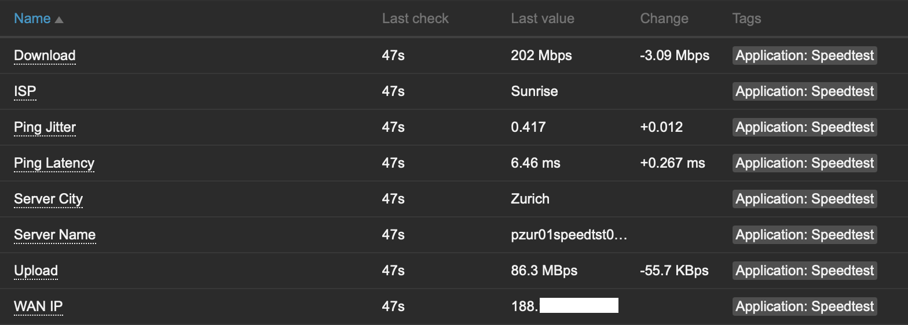
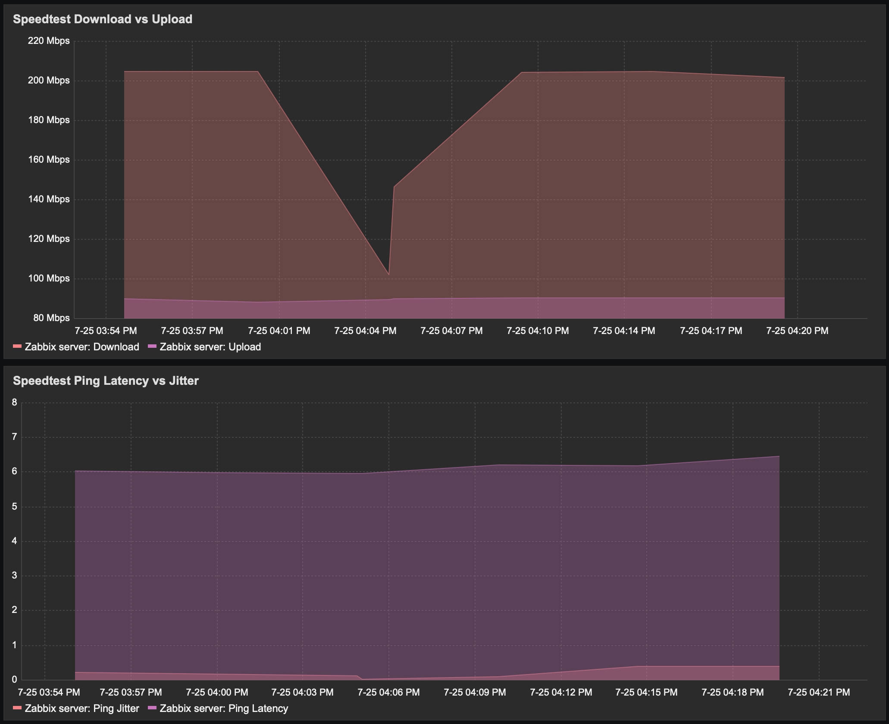

# Zabbix Internet Speedtest

Monitoring internet bandwidth using speedtest and zabbix. The script uses `zabbix_sender` to send the values to a Zabbix Server. The interval is set via cron.

Tested with Ubuntu 24.04 and uses:
* ([ookla speedtest cli](https://www.speedtest.net/apps/cli))
* ([zabbix sender](https://www.zabbix.com/documentation/current/en/manpages/zabbix_sender))
* Cron

Based on ([zabbix-speedtest-template](https://github.com/sebastian13/zabbix-template-speedtest)) and modified to use ([ookla speedtest cli](https://www.speedtest.net/apps/cli)) and a specific speedtest server.

## Screenshots
### Gathered Data


### Graphs


## How to

### Install official ookla speedtest cli

```bash
apt install curl
curl -s https://packagecloud.io/install/repositories/ookla/speedtest-cli/script.deb.sh | sudo bash
apt install speedtest
```

### Install zabbix sender
```bash
apt install zabbix-sender
```

### Download and update `speedtest-zabbix.sh`

```bash
mkdir -p /etc/zabbix/scripts
cd /etc/zabbix/scripts
curl -LO [https://raw.githubusercontent.com/sebastian13/zabbix-template-speedtest/master/scripts/speedtest-zabbix.sh](https://raw.githubusercontent.com/sjohner/zabbix-speedtest/refs/heads/master/scripts/speedtest-zabbix.sh)
chmod +x speedtest-zabbix.sh
```

Modify the server ID to match the speedtest server of your ISP

```bash
# Set ID of server you want to use for the speed test
ID=<SERVER ID>
```
You can use `speedtest -L` to a list of nearest servers. 

```
speedtest -L

Closest servers:

    ID  Name                           Location             Country
==============================================================================
 23969  Sunrise Communication AG       Zurich               Switzerland
 23723  SolNet                         Solothurn            Switzerland
 12660  Quickline AG                   Nidau                Switzerland
 42840  joelmueller.ch                 Bern                 Switzerland
 28472  Wingo AG                       Olten                Switzerland
 48663  IWB Telekom                    Basel                Switzerland
 70179  dyonix OÜ                     Nottwil              Switzerland
 49631  Arcade Solutions AG            Luzern               Switzerland
 16402  Wifx SA                        Yverdon-les-Bains    Switzerland
 31102  GIB-Solutions AG               Schlieren            Switzerland
 30002  WWZ Telekom AG                 Zug                  Switzerland
```

### Create Cronjob

The following cronjob will run the speedtest script every 30min
```bash
crontab -e

# m h  dom mon dow   command
*/30 * * * * /etc/zabbix/scripts/speedtest-zabbix.sh >/dev/null
```

### Import the Template `zbx_template_speedtest.xml` to Zabbix and assign in to a server.
